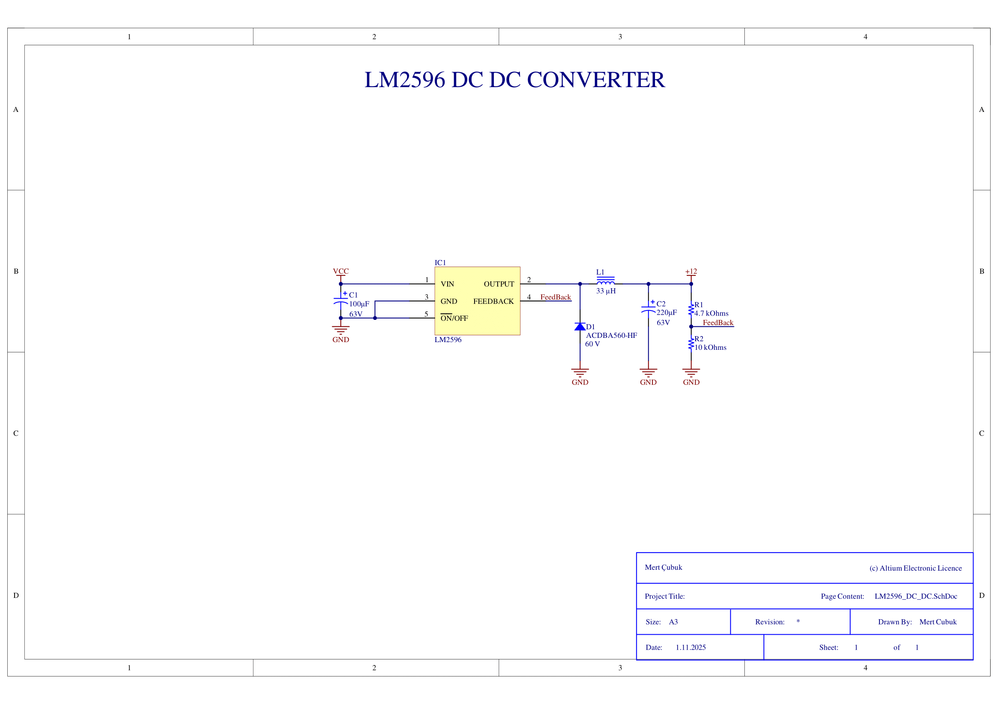
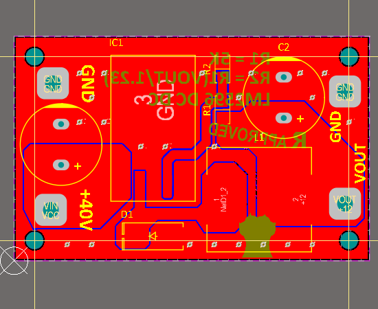
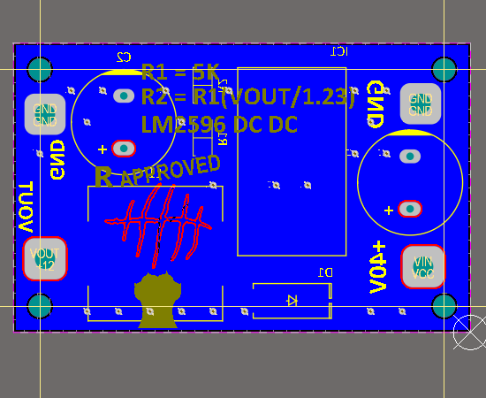
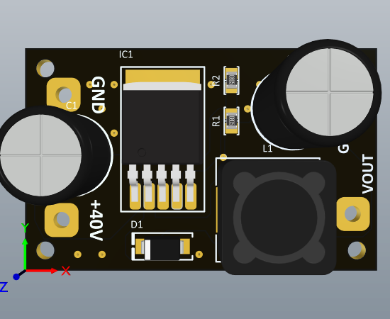
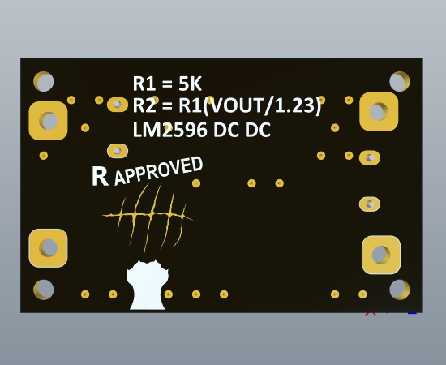

⚡ LM2596 DC–DC Converter

##  Proje Hakkında

Bu proje, LM2596 anahtarlamalı regülatör entegresi kullanılarak tasarlanmış, 4–40 V girişten ayarlanabilir 1.23–35 V çıkış sağlayabilen bir step-down (buck) dönüştürücü kartıdır.
Amaç, kompakt ve üretime uygun bir modül üzerinden güç elektroniği prensiplerini Altium Designer ile uygulamaktır.


##  Teknik Özellikler

| Özellik                  | Açıklama                                          |
| ------------------------ | ------------------------------------------------- |
| **Giriş Gerilimi**       | 4 V – 40 V DC                                     |
| **Çıkış Gerilimi**       | 1.23 V – 35 V DC *(R2 = R1 × (VOUT / 1.23 – 1))*  |
| **Maksimum Akım**        | 3 A *(soğutma koşuluna bağlı)*                    |
| **Verim**                | %80 – %92                                         |
| **Anahtarlama Frekansı** | 150 kHz                                           |
| **Endüktör**             | 33 µH, ferrit çekirdekli, Isat ≥ 3 A              |
| **Diyot**                | Schottky, 60 V / 5 A *(örnek: SS54, ACDBA560-HF)* |
| **Kapasitörler**         | Giriş: 100 µF / 63 V, Çıkış: 220 µF / 63 V        |
| **Kart Boyutu**          | ~50 mm × 30 mm                                    |
| **Katman Sayısı**        | 2 (Top / Bottom)                                  |
| **Tasarım Aracı**        | Altium Designer 24.2                              |
| **Üretim Durumu**        | Gerber çıkışı hazır, JLCPCB uyumlu                |


## 🗂️ Proje Yapısı

```text
📂 LM2596_DC_DC
 ┣ 📜 LM2596_DC_DC.PrjPcb
 ┣ 📜 LM2596_DC_DC.SchDoc
 ┣ 📜 LM2596_DC_DC.PcbDoc
 ┣ 📜 LM2596_DC_DC.SchLib
 ┣ 📜 LM2596_DC_DC.PcbLib
 ┣ 📜 README.md
 ┣ 📜 .gitignore
 ┣ 📂 Gerber_rar
 ┃ ┗ 📦 Gerber_Files.rar  → Üretime gönderilecek dosya (JLCPCB)
 ┣ 📂 images
 ┃ ┣ 🖼️ LM2596_DC_DC-shmatic.png
 ┃ ┣ 🖼️ pcb_top.2d.png
 ┃ ┣ 🖼️ pcb_bottom2d.png
 ┃ ┣ 🖼️ pcb_top3d.png
 ┃ ┗ 🖼️ pcb_bottom3d.png
 ┗  📂 Project Outputs for LM2596_DC_DC
   ┣ 📜 BOM.xlsx
   ┣ 📜 Design Rule Check - LM2596_DC_DC.html
   ┣ 📜 Status Report.txt
   ┗ 📂 Gerber / NC Drill / STEP dosyaları
 
```

## 🖼️ Görseller

| Görsel                                        | Açıklama         |
| :-------------------------------------------- | :--------------- |
|    | Şematik görünümü |
|        | PCB Top Layer    |
|  | PCB Bottom Layer |
|           | 3D Üst Görünüm   |
|     | 3D Alt Görünüm   |


## ⚙️ Öğrenilenler / Kazanımlar

- LM2596 buck topolojisi ve feedback direnç hesaplaması
- Layout optimizasyonu: giriş/çıkış yollarının kısa tutulması, GND döngüsü kontrolü
- Schottky diyot ve endüktör seçim kriterleri
- Altium’da kişisel logo / metin ekleme ve 3D PDF oluşturma
- Gerber ve BOM dosyası oluşturma süreci


## 🧠 Notlar

- R1 = 5 kΩ sabit, R2 = R1 × (VOUT/1.23 – 1) formülüne göre çıkış gerilimi ayarlanır.
- Yüksek akımlarda termal verimi artırmak için kalın bakır yollar veya daha büyük endüktör önerilir.
- Tüm komponent tasarımları ve 3D modeller, Celestial Altium Library kullanılarak oluşturulmuştur.
(All component designs and models are created using the Celestial Altium Library.)

---

© 2025 Mert Çubuk  
*Designed and documented with Altium Designer 24.2*  